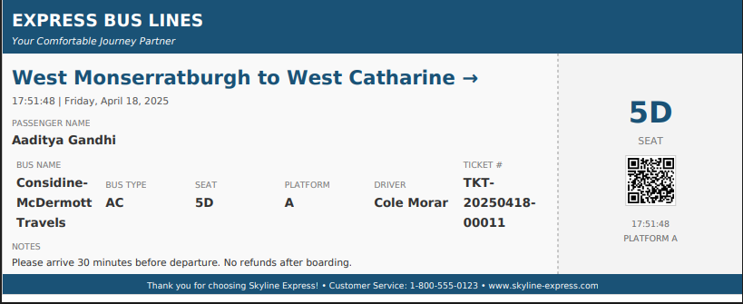
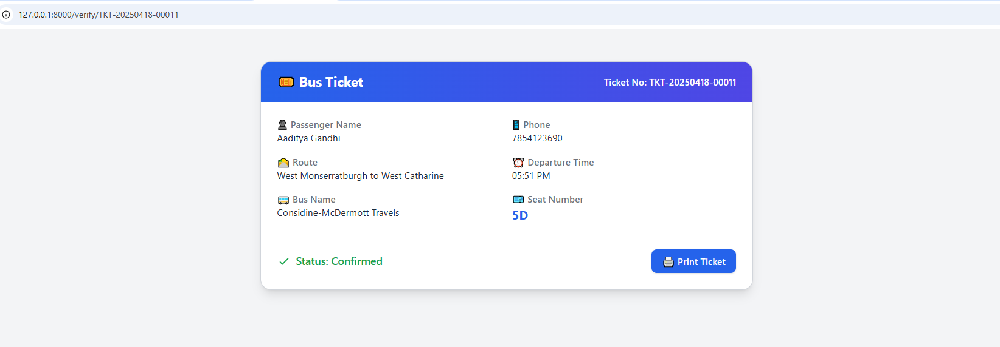
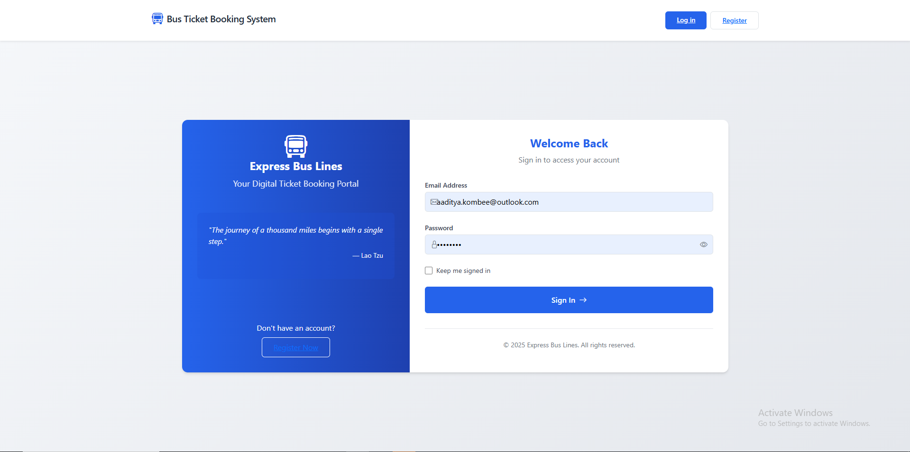
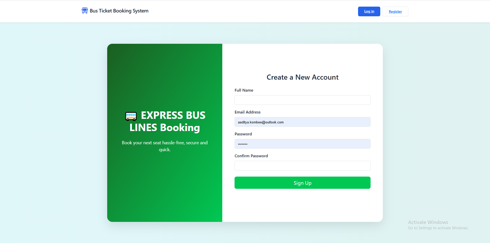
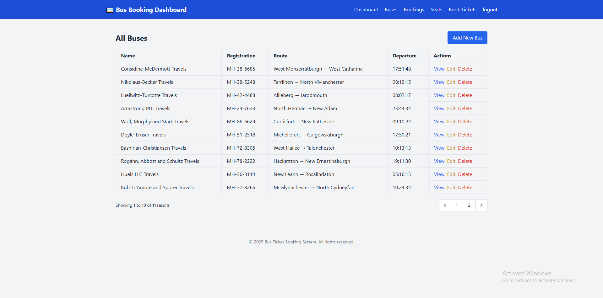
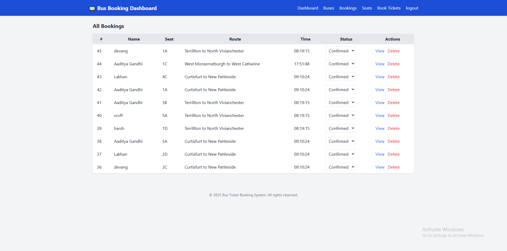
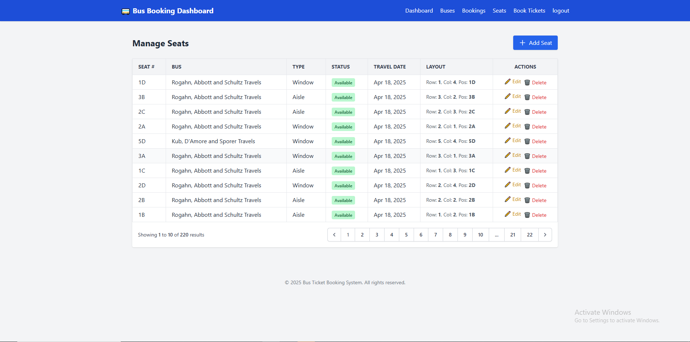
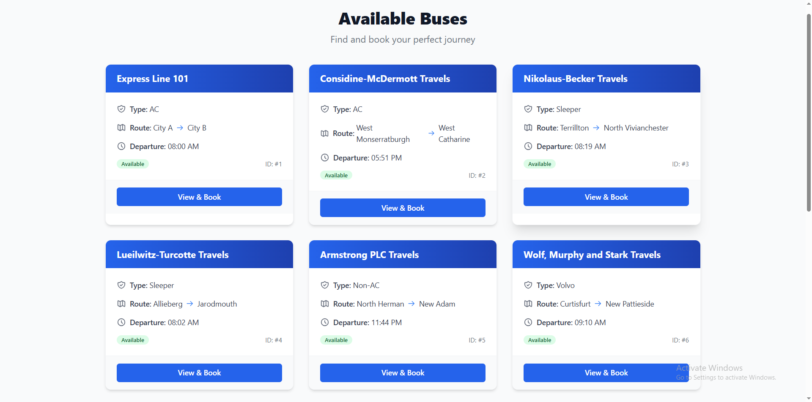
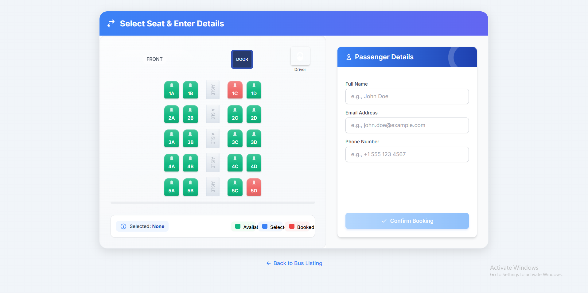

# 🚌 Laravel Bus Ticketing System

A modern Laravel-based bus ticket booking system with integrated **QR code ticketing**, real-time seat selection, and a user-friendly dashboard for managing bookings and buses.

## ✨ Features

- 🧾 **QR Code Ticketing**: Each booking generates a unique QR code for easy ticket verification.
- 🎫 **Seat Booking System**: Customers can choose available seats and receive a downloadable PDF ticket.
- 📩 **Email & Phone Details**: Collect passenger contact details during booking.
- 📄 **PDF Ticket Generation**: Auto-generated, downloadable tickets with embedded QR codes.
- 📊 **Admin Dashboard**:
  - View total buses and bookings
  - See recent bookings and upcoming bus departures
- 🚍 **Bus Management**: Admin can add, edit, and delete buses with departure times and routes.
- 💺 **Seat Management**: Assign seats to buses and mark them as booked.
- 🔒 **Authentication System**:
  - Custom login/register forms
  - Session-based authentication (no API needed)
- 📃 **Ticket Verification**:
  - Scan the QR code or visit a unique ticket URL for status confirmation.

## 📷 QR Code Example

> Each PDF ticket includes a QR code like this:


### 📌 Ticket



---

### 📌 QR code


### 📌 Verify Ticket




QR code points to: `http://127.0.0.1:8000/verify/TKT-20250418-00000`

---

## 🖼️ Screenshots

### 📌 Login



### 📌 Register



---

### 📌 Manage Buses



---

### 📌 Manage Bookings



---

### 📌 Manage Seats



---

### 📌 Bus Selection



### 📌 Seat Selection



---


## 🛠️ Tech Stack

- **Laravel 10+**
- **Livewire (optional for interactivity)**
- **Tailwind CSS**
- **Laravel DOMPDF**
- **Simple QR Code (Endroid or Laravel-Package)**
- **Passport (for future API access, currently not in use)**

## 🖥️ Pages

- `/` - Seat selection and booking
- `/login` & `/register` - Auth forms with validation
- `/dashboard` - Admin panel for managing bookings and buses
- `/verify/{ticket_number}` - Ticket status via QR code

## 📂 Folder Structure Highlights

```plaintext
BUS-TICKETING-SYSTEM/
├── app/
│   ├── Http/
│   │   ├── Controllers/
│   │   │   ├── AuthFormController.php
│   │   │   ├── BookingController.php
│   │   │   ├── BusController.php
│   │   │   ├── BusViewController.php
│   │   │   ├── Controller.php
│   │   │   ├── DashboardController.php
│   │   │   ├── ManageBookingController.php
│   │   │   └── SeatController.php
│   │   ├── Middleware/
│   │   └── Requests/
│   │       ├── LoginRequest.php
│   │       ├── RegisterRequest.php
│   │       ├── StoreBusRequest.php
│   │       ├── StoreSeatRequest.php
│   │       ├── UpdateBusRequest.php
│   │       └── UpdateSeatRequest.php
│   ├── Models/
│   │   ├── Booking.php
│   │   ├── Bus.php
│   │   ├── Seat.php
│   │   └── User.php
│   ├── Providers/
│   └── ... (Other standard App directories)
├── bootstrap/
│   ├── app.php
│   └── cache/
├── config/
│   ├── app.php
│   ├── auth.php
│   ├── database.php
│   ├── filesystems.php
│   ├── mail.php
│   ├── queue.php
│   ├── services.php
│   ├── session.php
│   └── ... (Other config files)
├── database/
│   ├── factories
│   ├── migrations/
│   │   ├── 0001_01_01_000000_create_users_table.php
│   │   ├── ... (Other standard migrations)
│   │   ├── 2025_04_16_065018_create_buses_table.php
│   │   ├── 2025_04_16_065045_create_seats_table.php
│   │   ├── 2025_04_16_065102_create_bookings_table.php
│   │   ├── ... (Other project-specific migrations)
│   └── seeders/
│       ├── BusSeeder.php
│       ├── DatabaseSeeder.php
│       └── SeatSeeder.php
├── public/
│   ├── css/
│   ├── js/
│   └── index.php
├── resources/
│   ├── css/
│   ├── js/
│   └── views/
│       ├── admin/
│       │   └── bookings/
│       │       ├── index.blade.php
│       │       └── show.blade.php
│       ├── auth/
│       │   ├── login.blade.php
│       │   └── register.blade.php
│       ├── buses/
│       │   ├── create.blade.php
│       │   ├── edit.blade.php
│       │   ├── form.blade.php
│       │   ├── index.blade.php
│       │   └── show.blade.php
│       ├── buses_view/
│       │   ├── index.blade.php
│       │   └── show.blade.php
│       ├── dashboard/
│       │   └── index.blade.php
│       ├── layouts/
│       │   ├── app.blade.php
│       │   └── auth.blade.php
│       ├── partials/
│       │   └── ... (Shared view components)
│       ├── seats/
│       │   ├── create.blade.php
│       │   ├── edit.blade.php
│       │   └── index.blade.php
│       ├── seats_view/
│       │   └── index.blade.php
│       ├── tickets/
│       │   ├── pdf.blade.php
│       │   └── verify.blade.php
│       └── welcome.blade.php
├── routes/
│   ├── api.php
│   ├── channels.php
│   ├── console.php
│   └── web.php
├── storage/
│   └── ... (Logs, framework files, app uploads)
├── tests/
│   └── ... (Feature and Unit tests)
├── vendor/
│   └── ... (Composer dependencies)
├── .editorconfig
├── .env
├── .env.example
├── .gitattributes
├── .gitignore
├── artisan
├── composer.json
├── composer.lock
├── package.json
├── phpunit.xml
└── README.md
```


## 🚀 Getting Started

```bash
git clone https://github.com/Web-Dev-Kombee/Bus-Ticketing-System.git
cd bus-ticketing-system
composer install
cp .env.example .env
php artisan key:generate
php artisan migrate
php artisan serve
